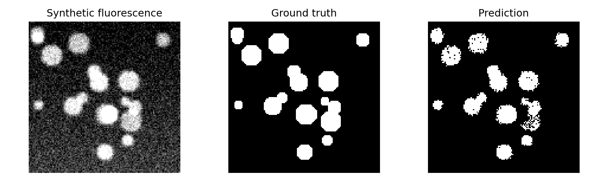

# Mouse Brain Cell Instance Segmentation

Public research companion for *Mouse Brain Cell Segmentation in Fluorescence
Microscopy Images* (CISS 2025).



## Best Evidence

- **What I built:** a public COCO-style companion for six-class fluorescence
  microscopy instance segmentation.
- **What is reproduced:** schema contracts, paper model configurations,
  AP/AR metric primitives, synthetic fixture evaluation, and qualitative
  overlays.
- **What is unavailable:** the private 1,050-image mouse-brain dataset and
  trained checkpoints.
- **Main verified result:** the deterministic synthetic fixture produces local
  AP `42.18`, AP50 `50.64`, and AR100 `41.42`; these are not comparable to the
  private paper benchmark.
- **How to verify:** `uv sync --frozen && make test && make reproduce-smoke`.

The repository provides the six-class COCO data contract, exact configurations
for the paper's six CNN/transformer methods, COCO-style AP/AR evaluation
primitives, and a deterministic synthetic fluorescence fixture. It does not
redistribute the private 1,050-image dataset or trained model checkpoints.

`DATA.md` documents the optional public extension path: BBBC038v1 from the
Broad Bioimage Benchmark Collection, a CC0 fluorescence nuclei instance
segmentation dataset suitable for a future transfer benchmark.

```bash
uv sync
make test
make reproduce-smoke
make reproduce-results
```
